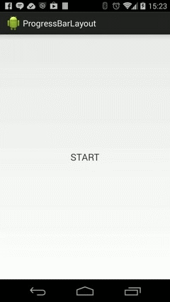

#ProgressBarLayout

This is a simple ProgressBar widget that fills out the whole available view concentrically starting from the middle. It also offers the possibility to automatically pass from the previous view to the progress bar to the next view through animations - if you set the views and don't set the animations, it will use the default AlphaAnimation set to crossfade the views in 1000ms.

You can see the example below. You could use this when, for example, loading the app or data for a view, in which case you could set the progress bar color to be the same as the one in the view after in order to have a seemless transition. You can see more details in the example app provided.

## CONFIGURATION AND USAGE

This widget is configured mainly through XML layout file. Here are the basic configurable parameters which are fairly self-explanatory (you can see the example in the example app):

    <attr name="beginningProgressSize" format="dimension" />
    <attr name="progressCircleColor" format="color" />
    <attr name="textProgressColor" format="color" />
    <attr name="textProgressSize" format="dimension" />
    <attr name="textProgressString" format="string" />
	<attr name="stepDurationInMs" format="integer" />

This is the basic widget setup - if you want to use it to also control the beginning view and ending view animation, you will need to set the beginning and ending views through code, like this for example:

    mBeginningTextView = (TextView) findViewById(R.id.beginning_tv);
    mEndingTextView = (TextView) findViewById(R.id.ending_tv);
    mCircleProgressView = (ProgressBarLayoutView) findViewById(R.id.expanded_circle_progress);
    mCircleProgressView.setBeginningCrossAnimationView(mBeginningTextView);
    mCircleProgressView.setEndingCrossAnimationView(mEndingTextView);

In case you don't want to set custom transition animations, it will look like in the animation above (AlphaAnimation, 1000ms, crossfading for the beginning view). If you want to set them, you need two sets of animation pairs, one for the progress bar view and the other for the other view (beginning or ending), with the animation set duration in ms:

    <attr name="beginningProgressAnimation" format="reference" />
    <attr name="beginningInverseProgressAnimation" format="reference" />
    <attr name="beginningProgressAnimationDurationInMs" format="integer" />
    <attr name="endingProgressAnimation" format="reference" />
    <attr name="endingInverseProgressAnimation" format="reference" />
    <attr name="endingProgressAnimationDurationInMs" format="integer" />

*(example soon to come)*

You can also setup a custom font for the progress text with simple `setTypeface(Typeface tf)` method.

## COMPATIBILITY

Android 2.3 (API 9) and up.

## DEPENDENCIES

None.

## LICENSE

This library is licensed under [Apache License, Version 2.0](http://www.apache.org/licenses/LICENSE-2.0.html).